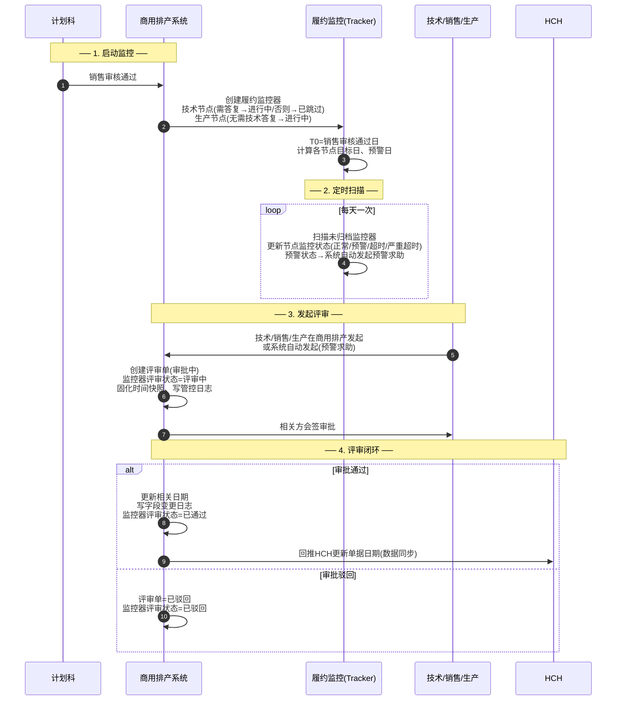
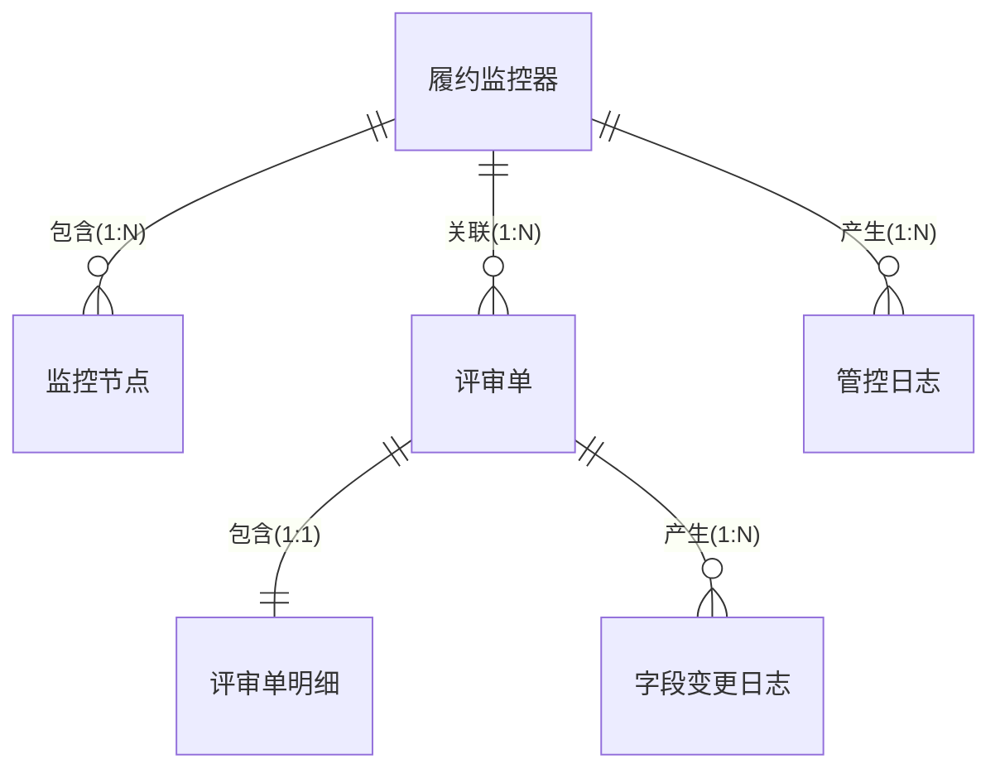
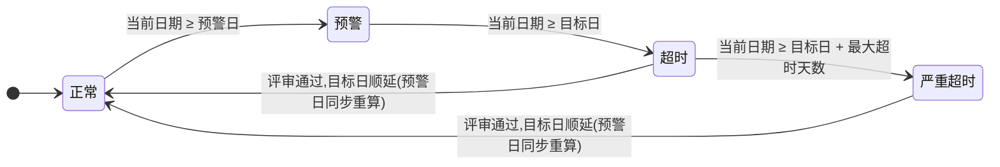
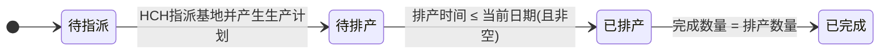
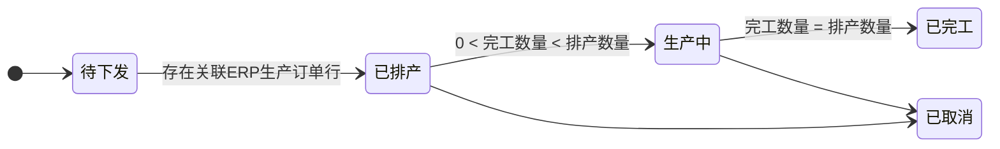

# 履约监控二期方案 — 整体方案 PRD

> 文档性质：面向**研发**与**测试**的需求讲解稿，是履约监控二期（MTO Tracker）的唯一整体规格来源。
> 适用范围：商用排产系统「MTO 履约监控（Tracker）」能力，二期。
> 上游依据：《履约监控二期方案-业务讨论稿》（业务口径权威）＋ 4 份页面规格说明（页面落地权威）。
> 阅读路径：研发先读「§4 核心业务流程 → §5 领域建模 → §6 状态机 → §8 关键规则」；测试先读「§3 需求范围 → §4 场景 → §8 规则 → §9 页面清单」。
> 本文档与页面规格不一致时，**以本文档的业务规则为准**；页面规格负责页面级交互细节。

---

## 1. 修订历史

| 版本 | 日期 | 修订说明 | 修订人 |
| --- | --- | --- | --- |
| V1.0 | 2026-08-25 | 首版：从《业务讨论稿》V0.9 与 4 份页面规格抽取，固化整体方案规格（领域建模、状态机、数据流、系统集成、会签矩阵、SLA 规则），供研发与测试讲解 | — |
| V1.1 | 2026-08-28 | 根据需求评审意见，调整生产部的操作流程，订单评审，生产部人员均在商用排产系统处理，不在HCH进行 | — |
| V1.2 | 2026-09-02 | 对齐生产库表（ER_SQL）：①技术侧「长线物料完工日期」统一为「长线图文完工日期」；②采购侧「采购完工日期」统一为「采购齐套日期」（长线采购齐套日期、各物料齐套日期）；③「已暂停」「已关闭」标注为后续拓展场景本期不涉及；④「交货日期」锚定排产情况表 `delivery_time`（发货日期=订单明细表 `delivery_date`）；⑤新增待确认项「排产基地说明状态与库表映射」 | — |
| V1.3 | 2026-09-03 | 补充`超期预警`，系统自动发起的表单字段赋值逻辑 |  |
| V1.4 | 2026-09-04 | 补充审批流程发起与流程变量，具体查看目录 8.7 |  |
| V1.5 | 2026-09-07 | 补充 §6.4「排产基地说明状态」四态状态机（待指派/待排产/已排产/已完成，二期新增）与 §6.5「生产计划状态」五态状态机；生产节点 SLA「已完成」锚定修正为「生产计划·已完工」（原误锚排产基地说明）；澄清「排产基地说明」对应库表「订单需求计划明细排产情况表」，与「生产计划」为 1:1 派生关系；判定字段统一为「排产时间」并补「待下发（排产时间为空）→ 待排产」兜底 |  |
| V1.6 | 2026-09-07 | §8.1 补充销售审核通过后的日期赋值逻辑：明确「整机生产完工日期」=「生产节点目标日」，统一为 T0+订单行【供货期】（不分场景，废弃交货周期/整机生产周期三场景）；采购侧「完工」统一「齐套」；日期基准「当前日期」统一「T0」；采购日期与技术日期在销售审核通过时同步赋值；长线采购齐套日期不限于大机组 |  |
| V1.7 | 2026-09-07 | 修正周期字段归属：区分「长线图文开发周期」（技术答复，用于长线图文完工日期）与「长线物料开发周期」（采购，用于长线采购齐套日期）；§8.8 补「整机生产完工日期（=生产节点目标日）赋值口径：初始 T0+供货期，之后以评审手工调整后最新值为准」衔接说明 |  |

---

## 2. 业务背景与目标

### 2.1 业务诉求

MTO 订单从销售审核到车间完工，经过技术出图、物料采购、生产排产等环节。履约监控（Tracker）解决三件事：

- **看得见**：技术、生产两个关键节点进度一目了然；
- **分得清**：区分「软协调（不停线、组织对齐）」与「硬评审（升级、留痕）」，避免一刀切；
- **查得到**：谁在何时把某日期从哪天改到哪天、为什么改，可追溯到具体评审单。

### 2.2 建设目标

1. 履约进度可视化（技术、生产两节点）；
2. 风险分级管控（软/硬管控分级，不停线）；
3. 变更全程可追溯（结构化评审单 + 管控日志 + 字段变更日志）；
4. 自动化监控（系统定时扫描 SLA、自动预警、预警求助自动发起）。

### 2.3 关键术语（速览）

| 术语 | 含义 |
| --- | --- |
| 履约监控器 | 一条「排产基地说明」数据行的履约监控载体（主单据） |
| 监控节点 | 技术节点 / 生产节点 / 采购节点 |
| T0 | 销售审核通过日（技术、生产节点统一） |
| 目标日 | 节点计划完成日 |
| 预警日 | 目标日 − roundup(完整监控周期 × 预警比例)，节点启动时一次算定并持久化 |
| 评审单 | 各种评审场景的统一单据载体 |

其中Roundup是向上取整。

---

## 3. 需求范围

### 3.1 本期范围（二期）

1. **履约监控器**：销售审核通过后自动创建，跟踪技术、生产两节点。
2. **SLA 监控**：定时扫描，更新节点监控状态（正常/预警/超时/严重超时）。
3. **订单评审**：重大变更、客户加急、预警求助、超期评审 4 类场景（技术修订一期已上线，二期仅评估其是否纳入 SLA 监控，不在本期建设）。
4. **生产部操作**：订单评审场景下，生产部全流程在商用排产系统处理，不在HCH进行操作。
5. **日志与审计**：管控日志 + 字段级变更审计历史。

### 3.2 范围外（与业务明确后调整规则）

| 项 | 说明 |
| --- | --- |
| 技术修订评审 | 一期已上线，不在二期范围 |
| 硬熔断/自动停线 | 二期不做硬熔断；停工由生产部线下处理（删 ERP 生产订单 → BI 回流更新排产进度） |
| 采购节点 SLA 监控 | 采购节点恒为「已跳过」，不参与 SLA 倒计时 |
| 超期自动发起评审 | 超期仅人工发起；系统自动发起仅限「预警求助」 |
| 日期自动联动反推 | 过程日期由评审人手工逐项填写（见 §8.7） |

### 3.3 商品类型与节点监控关系

| 商品类型 | 技术节点 | 生产节点 | 采购节点 |
| --- | --- | --- | --- |
| 非标-非规格下单（需技术答复） | 监控 | 监控 | 不监控（仅展示） |
| 固化大机组 / 非标-规格下单（无需技术答复） | 已跳过 | 监控 | 不监控（仅展示） |

---

## 4. 核心业务流程

### 4.1 场景汇总

| 场景类型 | 发起方 | 是否停线 | 系统自动发起 |
| --- | --- | --- | --- |
| 重大变更 | 销售（人工） | 否 | 否 |
| 客户加急 | 销售（人工） | 否 | 否 |
| 预警求助 | 技术 / 生产（人工）/ 系统自动 | 否 | **是**（节点进入预警状态时） |
| 超期评审 | 技术 / 生产（人工） | 否 | 否 |

> 系统自动发起（仅预警求助）：发起方类型 = `系统`，发起人 = 当前排产基地数据所属需求计划明细的审核人。

### 4.2 全局主流程

### 4.3 场景一：启动履约监控

1. 计划科销售审核通过 → 系统创建履约监控器（状态=正常）。
2. 技术节点赋值：无需技术答复 → 已跳过；需技术答复 → 进行中。
3. 生产节点：无需技术答复 → 销售审核通过时进入进行中；需技术答复 → 技术答复生产文件号后进入进行中。
4. 计算节点目标日与预警日（见 §8.1）。
5. 启动定时监控（每天一次）。

### 4.4 场景二：销售 / 技术 / 生产 发起订单评审

**基础规则**：同一排产需求同一时刻仅 1 张评审单；评审期间不重复发起；评审单创建时固化「时间快照」（快照内容与用途见 §8.4）。生产部审批全程在商用排产系统闭环，不再到 HCH 操作。

数据流程：

1. 发起方在商用排产选择「场景类型」发起：
   - 销售：重大变更 / 客户加急；
   - 技术：预警求助 / 超期评审（超期评审技术发起仅限非标-非规格下单）；
   - 生产：预警求助 / 超期评审（标准、非标-规格下单的超期评审由生产发起）。
2. 商用排产创建评审单：监控器评审状态 = 评审中；评审单状态 = 审批中；记录发起方、场景类型；写管控日志。
3. 商用排产内部会签审批（发起方不参与会签，会签部门见 §8.6）。
4. 根据审批结果处理：
   - **审批通过**：更新相关日期 → 评审单 = 已通过 → 监控器评审状态 = 已通过 → 写管控日志 → 写字段级变更日志 → 回推 HCH 更新相关日期。
   - **审批驳回**：评审单 = 已驳回 → 监控器评审状态 = 已驳回 → 写管控日志 → 回推 HCH 更新审批结果。

---

## 5. 业务领域建模与实体设计

履约监控二期围绕 6 个核心业务对象展开，业务实体关系如下：

### 实体关系基数说明

| 实体关系 | 基数 | 说明 |
| --- | --- | --- |
| 履约监控器 ↔ 监控节点 | **1 : N** | 一个监控器包含技术 / 生产 / 采购等多个节点；一个节点只属于一个监控器 |
| 履约监控器 ↔ 评审单 | **1 : N** | 一个监控器在其生命周期内可发起多次评审（仅关联最新评审单）；同一时刻仅存在 1 张进行中的评审单 |
| 履约监控器 ↔ 管控日志 | **1 : N** | 一个监控器产生多条生命周期事件日志 |
| 评审单 ↔ 评审单明细 | **1 : 1** | 一个评审单对应一条明细内容（不同场景对应不同表单内容） |
| 评审单 ↔ 字段变更日志 | **1 : N** | 一个评审单可变更多个日期字段，每个字段一条变更记录 |

### 5.1 履约监控器（主单据）

**业务定义**：一条「排产基地说明」数据行的履约监控载体，代表一个可履约的排产单元从销售审核通过到车间完工的全程监控对象。

- 直接锚定「排产基地说明」，而非需求计划明细行——因为一条明细行可能拆分为多条排产基地说明，履约监控按排产基地说明逐条跟踪。
- 承载监控器的整体状态、评审状态，以及当前关联的评审单号。

### 5.2 监控节点

**业务定义**：履约监控器下需要跟踪的进度节点，分为技术节点、生产节点、采购节点三类。

- 每个节点具备「完工状态」（未开始 / 进行中 / 已完成 / 已跳过）、目标日、预警日、实际完工日。
- 目标日与预警日在节点启动时一并算定并持久化（预警日 = 目标日 − roundup(完整监控周期 × 预警比例)，见 §8.1）；目标日顺延时预警日重算。
- 技术节点含两个子日期（技术图文完工日期、长线图文完工日期），两者全部完成才算「已完成」。
- 采购节点恒为「已跳过」，不参与 SLA 倒计时，仅作信息展示。

### 5.3 评审单

**业务定义**：各类评审场景（重大变更、客户加急、预警求助、超期评审）的统一单据载体。

- 记录发起方（销售 / 技术 / 生产 / 系统）、场景类型、审批状态，并关联审批流程实例。
- 评审单号生成规则：`DDPS + 年月日 + 3 位流水号`（如 DDPS20260819001）。

### 5.4 评审单明细

**业务定义**：评审单的业务内容载体，不同场景对应不同表单内容（如重大变更的"交货日期变更"、预警求助的"风险类型 + 变更原因"）。

### 5.5 字段变更日志

**业务定义**：记录评审单审批通过后，哪些日期字段发生了从什么值变更到什么值，用于事后追溯（谁在何时把某日期从哪天改到哪天）。

### 5.6 管控日志

**业务定义**：记录履约监控器生命周期中的关键事件（谁在何时发起了什么、审批结果如何），按时间序可完整还原履约过程。

---

## 6. 状态机设计

### 6.1 状态机一：监控状态（健康度，4 态）

描述节点相对目标日、预警日的健康度：

| 状态 | 判定条件 |
| --- | --- |
| 正常 | 当前日期 < 预警日 |
| 预警 | 预警日 ≤ 当前日期 < 目标日 |
| 超时 | 当前日期 ≥ 目标日 |
| 严重超时 | 当前日期 ≥ 目标日 + 最大超时天数（默认 7 天） |

> 监控器整体状态取两个节点中最严重的一档（任一节点严重超时 → 监控器严重超时）。
> 目标日顺延（评审通过）后，预警日按新目标日重算（见 §8.1），节点监控状态随新目标日、预警日重新判定。

### 6.2 状态机二：评审状态

| 状态 | 业务含义 |
| --- | --- |
| 空白 | 默认，不存在评审单 |
| 评审中 | 存在一张进行中的评审单 |
| 已通过 | 当前关联评审单状态 = 已通过 |
| 已驳回 | 当前关联评审单状态 = 已驳回 |

> 同一监控器可能多次评审，仅关联最新评审单。
> 评审会签与生产部审批全程在商用排产系统闭环；评审闭环后回推 HCH 更新单据相关日期（数据同步，非审批环节）。

### 6.3 状态机三：完工状态（节点生命周期，4 态）

| 状态 | 判定条件 |
| --- | --- |
| 未开始 | 默认状态（如生产节点需技术答复时，技术答复前为未开始） |
| 进行中 | 节点进入监控范围时（生产节点：无需技术答复=销售审核通过时；需技术答复=技术答复生产文件号后） |
| 已完成 | 见下方「已完成」定义 |
| 已跳过 | 节点无需监控时（如标准商品的技术节点、采购节点） |

「已完成」定义：
- **技术节点**：技术图文完工日期（实际）非空，且 长线图文完工日期（实际）非空；
- **生产节点**：对应「生产计划」的排产状态 = 已完工（见 §6.5 状态机五）。

### 6.4 状态机四：排产基地说明状态（4 态）

**对象定义**：「排产基地说明」（对应库表「订单需求计划明细排产情况表」`ps_order_demand_plan_detail_production_scheduling`）的排产状态，反映订单侧排产情况从"推送 HCH → 指派基地 → 排产 → 完成"的流转。

**与「生产计划」的关系（1:1 派生）**：
- 「排产基地说明」业务单据**先创建**，「生产计划」**后创建**；生产计划存在的前提是排产基地说明。
- 一个排产基地说明**仅对应一个生产计划**（1:1），不存在多基地 / 1:N 场景。
- 判定规则：`排产基地说明状态 ≠ 待指派` ⇔ 已存在关联的生产计划；`排产基地说明状态 = 待指派` ⇔ 生产计划尚未产生。
- 除「待指派」外，「待排产 / 已排产 / 已完成」的判定字段（排产时间 / 完成数量 / 排产数量）均**派生自关联的唯一生产计划**（`production_scheduling_time` / `completed_quantity` / `production_scheduling_num`）。
- **「排产时间」术语统一**：本状态机的「排产时间」即库表 `production_scheduling_time`（注释「排产时间，ERP 生产订单最小的排产时间」）。页面规格说明-生产计划.md 列表中的「排产时间」与此同义，不另设「排产日期」术语。

| 状态 | 判定条件 | 与生产计划的关系 |
| --- | --- | --- |
| 待指派 | 需求计划明细行已推送到 HCH，HCH 未指派基地 | 生产计划不存在 |
| 待排产 | 已有排产基地，且（排产时间为空 或 排产时间 > 当前日期） | 生产计划已存在（含「待下发」：无 ERP 订单、排产时间为空） |
| 已排产 | 已有排产基地，排产时间非空且 ≤ 当前日期，且完成数量 < 排产数量 | 生产计划已存在 |
| 已完成 | 已有排产基地，排产时间非空且 ≤ 当前日期，且完成数量 = 排产数量 | 生产计划已存在（通常 = 已完工） |

> **说明**：本状态机为二期新增。库表「排产情况表」当前仅有「开发状态」字段、无「排产状态」字段，需技术方案落地时新增字段与数据字典；其判定字段派生自 1:1 关联的「生产计划」。

### 6.5 状态机五：生产计划状态（5 态）

**对象定义**：「生产计划」（对应库表「月生产计划明细表」`ps_monthly_production_plan_detail`）的排产状态，反映生产执行侧从"待下发 ERP → 排产 → 生产 → 完工"的流转。生产节点 SLA 的「已完成」锚定本状态机的「已完工」。

| 状态 | 判定条件 |
| --- | --- |
| 待下发 | 生产计划不存在关联的 ERP 生产订单 |
| 已排产 | 排产数量 > 0，且存在关联的 ERP 生产订单行 |
| 生产中 | 0 < 完工数量 < 排产数量 |
| 已完工 | 完工数量 = 排产数量 |
| 已取消 | 预留状态，当前业务场景暂无（后续拓展） |

> **字段来源**：排产数量 `production_scheduling_num`、完工数量 `completed_quantity`、排产时间 `production_scheduling_time` 均来自库表「生产计划明细表」；完工数据由 ERP 生产订单经 BI 回流。

---

## 7. 核心系统流程

### 7.1 系统集成关系

| 系统 | 集成方向 | 说明 |
| --- | --- | --- |
| ERP | 单向（回流） | 生产部线下删 ERP 生产订单 → BI 回流 → 更新排产进度（硬熔断线下处理路径） |
| BI | 单向（回流） | 回流排产进度/完工数据，用于「已完成」判定 |

### 7.2 定时扫描流程

1. 每日一次，扫描未归档的履约监控器。
2. 对每个节点，按当前日期与持久化的目标日、预警日比较，更新「监控状态」（预警日为节点启动时算定并落库的持久化值，扫描时直接读取，不实时重算）。
3. 节点进入「预警」状态时，触发「预警求助」系统自动发起（发起方=系统）。

### 7.3 系统定时发起预警

如当前的排产说明数据，监控器不存在`评审中`的评审单，则满足条件系统自动发起【超时预警】的订单评审流程。
相关表单字段赋值逻辑
| 变更类型 | 表单字段 | 填写说明 | 默认值取值说明 |
| --- | --- | --- | --- |
| 预警求助 | 风险类型 |  | 取值：订单延误 |
|  | 变更原因 |  | 系统自动发起预警求助，请相关方审核 |
|  | 是否需要暂停生产 |  | 否 |
>业务规则说明：
>1. 系统自动发起，不涉及到日期填写，订单评审单的相关日期，自动抓取需求计划明细行的现有相关日期
>2. 每个排产说明数据，预警求助，如本次触发发起时，已存在 `评审中`的评审单，则本次不发起。
>3. 每次订单评审通过后，系统仍然需要定时监控各个节点的日期，如存在【超时预警】，需要自动在发起评审流程。
>4. 审批流的顶级组织赋值：赋值为当前流程创建人的所在的顶级组织

---

## 8. 关键业务规则

### 8.1 T0 与目标日、预警日

- **T0** = 销售审核通过日（技术节点、生产节点统一）。
- **技术节点目标日** = `min(技术图文完工日期, 长线图文完工日期)`（取较早）。
- **生产节点目标日** = `整机生产完工日期`。
- **生产节点启动时机（进入进行中）**：
  - 无需技术答复（标准订单商品）→ 销售审核通过时；
  - 需技术答复（非标订单商品）→ 技术答复生产文件号后。
- **预警日** = `目标日 − roundup(完整监控周期 × 预警比例)`，预警比例（默认 20%）为数据字典可配置项。
  - **完整监控周期** = `目标日 − 节点启动日`（节点启动日 = 节点进入「进行中」开始倒计时的那一天：技术节点 = T0；生产节点 = 无需技术答复时 T0、需技术答复时技术答复生产文件号日）。
  - **一次性算定并持久化**：预警日在节点启动时计算一次并作为监控节点的持久化属性落库，此后不随「当前日期」变化（不是"目标日 − 当前日期"的实时重算）。
  - **短周期无预警窗口**：当 `roundup(完整监控周期 × 预警比例) < 1` 时，预警日 = 目标日（即无预警窗口，节点由「正常」直接进入「超时」），不做最小预警提前量兜底。
  - **目标日顺延后重算**：评审通过导致目标日顺延时，预警日按新目标日与完整监控周期**重新计算并覆盖**。

> 补充说明：销售审核通过后，各日期的赋值逻辑（日期基准统一为 **T0 = 销售审核通过日**）：
> **相关技术日期**（仅针对非标订单、且带有咨询单）：
>  - 技术图文完工日期 = T0 + 咨询单答复【图文明细开发周期】；
> - 长线图文完工日期 = T0 + 咨询单答复【长线图文开发周期】；
>
> **相关采购日期**（仅针对非标订单、且带有咨询单；销售审核通过时与技术日期同步赋值）：
>  - 压缩机采购齐套日期 = T0 + 咨询单答复【压缩机采购周期】（仅大机组才有值）；
> - 壳管采购齐套日期 = T0 + 咨询单答复【壳管采购周期】（仅大机组才有值）；
> - 变频器采购齐套日期 = T0 + 咨询单答复【变频器采购周期】（仅大机组才有值）；
> - 长线采购齐套日期 = T0 + 咨询单答复【长线采购周期】（所有非标带咨询单均有值，不限于大机组）；
>
> **相关生产日期**：
> - 整机生产完工日期（即生产节点目标日）= T0 + 订单行【供货期】。所有商品类型统一此公式，不分场景；供货期为订单行结果值，排产系统直接读取、不做业务处理（订单 0830 新增该字段）。
---
### 8.2 技术节点两个子日期（仅需技术答复时）

- 技术图文完工日期 = T0 + 咨询单答复【图文明细开发周期】；
- 长线图文完工日期 = T0 + 咨询单答复【长线图文开发周期】；
- 技术节点「完工」判定 = 两个子日期均产生实际完工时间。

### 8.3 采购节点

采购节点监控状态恒为「已跳过」；长线采购齐套日期、各物料齐套日期仅作信息展示，不参与 SLA 倒计时。采购异常影响生产时，由生产部手工发起「预警求助」（风险类型=物料晚到/齐套影响）。

### 8.4 评审单发起约束

- 同一排产需求（排产基地说明）同一时刻仅一张评审单，评审期间不重复发起。
- **时间快照**：评审单创建那一刻，按节点固化以下内容（防评审过程中状态漂移）：
  1. 完工状态（未开始 / 进行中 / 已完成 / 已跳过）；
  2. 监控状态（正常 / 预警 / 超时 / 严重超时）；
  3. 目标日（技术节点 = min(技术图文完工日期, 长线图文完工日期)；生产节点 = 当前目标日；已跳过 / 未开始节点天然为空）；
  4. 预警日（已跳过 / 未开始节点天然为空）。
  - 每个节点均记录，已跳过节点其完工状态即为「已跳过」，无需特殊逻辑处理。
  - 发起时超期天数 = 发起时间 − 目标日，由以上固化值动态推导，不单独存储。
  - 技术节点的两个子日期（技术图文 / 长线图文完工日期）属原始日期，其变更追溯由「字段变更日志」负责，快照不重复固化。
  - **用途边界**：时间快照仅用于订单评审的查看与后续回溯原始单据内容，不参与任何业务规则判断（如评审通过后的目标日顺延，以当前最新目标日为基准，而非快照值）。
- 评审单号：DDPS + 年月日 + 3 位流水号。

### 8.5 试运行不自动停线

「是否需要暂停生产」默认「否」；当前业务不存在暂停产线场景；停线决策由评审结论驱动、车间现场执行。

### 8.6 会签规则（权威矩阵）

审批流程在发起时根据 `场景类型 + 商品类型` 确定审批节点，不运行时动态判断。**发起方不参与会签**（预警求助发起人是否参与由审批流灵活配置）。

| 场景 | 商品类型 | 发起方 | 会签部门（必签） | 可选通知部门 |
| --- | --- | --- | --- | --- |
| 重大变更/客户加急 | 标准 | 销售 | 生产 | — |
| 重大变更/客户加急 | 非标 | 销售 | 技术、采购、生产 | — |
| 预警求助 | 标准 / 非标 | 技术/生产/系统 | —（发起人为流程首节点审批人，初步不参与会签，是否参与由审批流灵活配置） | 其余部门（对应节点=已跳过则不在可选列表） |
| 超期评审 | 非标-非规格下单 | 技术 | 销售、采购、生产（技术发起方不参与会签） | — |
| 超期评审（生产发起） | 固化大机组 / 非标-规格下单 | 生产 | 销售 | — |
| 超期评审（生产发起） | 非标-非规格下单 | 生产 | 销售、技术 | — |
| 技术修订 | 非标-非规格下单 | 销售 | 技术 | — |

> 采购不发起评审，仅作为重大变更/超期评审的非标会签方，预警求助不参与。
> 生产部审批均在商用排产系统操作（不再到 HCH），评审闭环后回推 HCH 更新单据日期。

### 8.7 审批流程发起与流程变量

基于现有的审批流程（流程key=`ps_order_demand_plan_review__change`),扩展现有的流程变量：
1. 场景类型：技术修订/重大变更/客户加急/预警求助/超期评审
2. 商品类型：标准，非标规格，非标非规格
3. 发起方：销售/技术/生产/系统

补充说明：商品类型的定义：
- 标准：需求计划明细行的商品属性=标准机，则其明细行的商品类型为 标准
- 非标规格：需求计划明细行的商品属性=非标，且关联的订单行的 生产用编码不为空，则其明细行的商品类型为 非标规格
- 非标非规格：需求计划明细行的商品属性=非标，且关联的订单行的 生产用编码为空

### 8.8 日期更改说明规则

交货日期属于「结果值」，结果值缩短时需反推过程日期联动调整。规则已明确：过程日期由评审人**手工逐项填写**，仅校验 ≥ 今日；销售改交货日期，其他日期由相关会签人员填写。生产部发起的评审同样遵循此规则。

> **整机生产完工日期（=生产节点目标日）赋值口径**：初始赋值用 T0+订单行【供货期】（见 §8.1），之后以评审手工调整后的最新值为准。

---

## 9. 页面与交互说明（页面清单）

| 页面 | 入口 | 核心职责 | 规格文档 |
| --- | --- | --- | --- |
| 销售审核-已处理Tab | 销售审核-标准订单/非标订单 | 销售发起订单评审（重大变更/客户加急）、审批订单评审 | 履约监控二期方案-页面规格说明-销售审核.md |
| 非标定制-技术开发 | 非标定制-技术开发 | 技术发起订单评审（预警求助/超期评审）、处理审批单 | 履约监控二期方案-页面规格说明-非标定制-技术开发.md |
| 履约监控Tab | 非标定制-技术开发-查看 / 销售审核-查看 | 履约节点展示、管控日志、日期变更审计 | 履约监控二期方案-页面规格说明-需求计划详情页-履约监控Tab.md |
| 审批详情页 | 销售审核-已处理-审批调整单 / 非标定制-技术维护-处理调整单 / 履约监控Tab | 评审基础信息、订单上下文、变更信息（按场景） | 履约监控二期方案-页面规格说明-履约监控-审批详情页.md |

---

## 10. 附录

### 10.1 待确认事项

| 优先级 | 问题 | 当前口径 |
| --- | --- | --- |
| P0 | 「最大超时天数」取值 | 默认 7 天，业务最终取值待定 |
| P1 | 技术节点「完工」是否严格到两个子日期均实际完工 | 当前口径：两者均完工才算已完成 |
| P1 | BI 回流延迟导致的「虚假超期」自动关闭 | 未纳入，建议补充 |
| P1 | 监控状态是否收敛为 3 态（去「严重超时」档） | 当前保留 4 态，严重超时仅作展示档位，不触发独立评审场景 |
| P2 | 主 PRD §5.4 字段 `long_lead_material_finish_date` 语义归位 | 已定论：技术侧统一「长线图文完工日期」（SQL 注释为准需反向修正）；采购侧「完工」统一「齐套」 |
| P1 | 「排产基地说明」状态与库表的映射 | 已澄清：排产基地说明 = 库表「订单需求计划明细排产情况表」（非「基地需求分布表」，后者面向月生产计划）；其「排产状态」为二期新增（库表当前仅有「开发状态」字段），按 §6.4 四态流转 |
| P1 | 排产基地说明状态判定字段来源 | 已定论：判定字段（排产时间/完成数量/排产数量）派生自 1:1 关联的「生产计划」（`production_scheduling_time`/`completed_quantity`/`production_scheduling_num`）；「排产时间」= `production_scheduling_time`；生产计划「待下发」时排产时间为空 → 排产基地说明归「待排产」；排产基地说明先创建、生产计划后创建，`状态≠待指派` ⇔ 已存在生产计划，无多基地场景（见 §6.4） |

### 10.2 相关文档

| 文档 | 说明 |
| --- | --- |
| 《履约监控二期方案-业务讨论稿》 | 业务口径权威（V0.9） |
| 4 份页面规格说明 | 页面落地权威 |
| 《MTO场景整体整合方案-PRD.md》 | 主 PRD（二期履约监控口径以本文档/业务讨论稿为准） |
| 《MTO履约控制塔Tracker-PRD.md》 | Tracker 独立 PRD（历史参考） |
