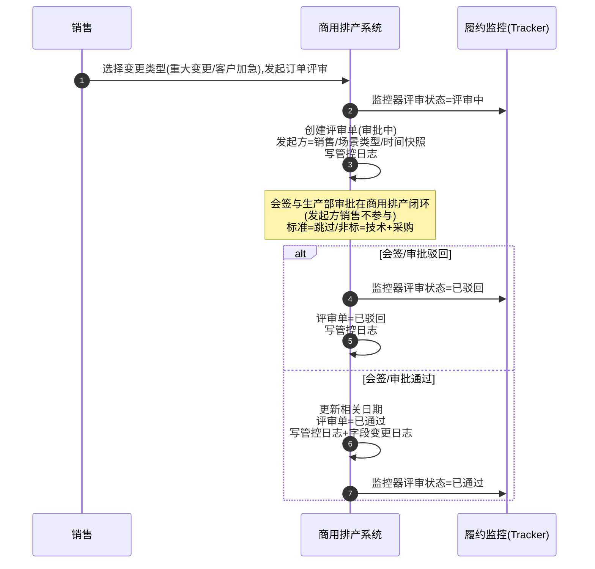

## 修订历史

| 版本   | 日期         | 修订说明                                      | 修订人 |
| ---- | ---------- | ----------------------------------------- | --- |
| V1.1 | 2026-09-02 | 「已关闭」明细行状态标注为后续拓展场景本期不涉及；「交货日期」字段取源订正为排产情况表 `delivery_time`（原取「计划发货日期」为笔误）| —   |
| V1.2 | 2026-09-03 | 调整销售审核列表上，已处理的状态与按钮控制逻辑，调整为关联的生产计划明细的状态| —   |

## 页面入口
销售审核-标准订单
销售审核-非标订单

## 数据权限

| 维度 | 规则 |
| --- | --- |
| 一致性 | 数据列表权限与管理端**订单列表**一致 |
| 部门监管 | 订单的所属组织（创建人所在的组织），属于当前操作用户所**部门监管**的组织（**包含下级组织**） |
| 渠道监管 | 订单的所属渠道网点，属于当前操作用户所**渠道监管**的网点 |
| 产品线 | 订单的产品线与账号所在组织配置的产品线一致 |
| 下发逻辑 | **（部门监管 ∪ 渠道监管）∩ 产品线** |

## 菜单权限

数据列表新增Tab：
- 已处理：展现已处理的需求计划明细行排产数据，单据类型为 【排产基地说明】
- 待处理：展现待处理的需求计划明细行，单据类型为【需求计划明细行】
2个Tab均需配置对应的菜单权限

## 列表与状态操作说明
| 需求计划明细行状态 | 业务含义 | 行上可见操作 | 附加可见条件 |
| --- | --- | --- | --- |
| **待处理** | 订单已推送排产，等待销售审核 | 查看；提交；库存充足；单机提交 | **单机提交**：商品为**套机**才展现（见下方「套机判定」；与列「单机/整机」展示字段无关） |
| **已分单（无需排产）** | 库存充足，无需排产，流程在 L1 结束 | 查看 | — |
| **已分单** | 需排产，已记录排产方式/订单等级，进入后续链路 | 查看；审批评审单；修订 | **审批评审单**：排产基地说明，存在关联的评审单，且`状态=评审中` 且当前用户为该评审流审批人 → 跳转评审单详情；**修订**：仅当前的开发状态!=`无需处理`时展现，二次确认后发起 `scene_type=技术修订` 评审流程；**发起订单评审** ：当前不存在`状态=审批中`的评审单，二次确认后发起订单评审，其中场景类型为用户选择的场景类型 |
| **已关闭** | 订单取消或流程终止（**本期不涉及，后续拓展场景**） | 查看 | — |

排产基地所关联的相关【生产计划】的状态和操作，区分2种场景：
1. 排产基地说明数据存在【生产计划】：即HCH已指派基地，且成功返回生产计划
2. 排产基地说明数据，不存在【生产计划】，则操作仅存在 查看 按钮，不存在其他按钮。

| 生产计划明细状态 | 业务含义 | 行上可见操作 | 附加可见条件 |
| --- | --- | --- | --- |
| **待下发** | 生产计划不存在关联的ERP生产订单 | 查看；修订；发起订单评审；审批评审单 | **审批评审单**：排产基地说明，存在关联的评审单，且`状态=评审中` 且当前用户为该评审流审批人 → 跳转评审单详情；**修订**：仅当前的开发状态!=`无需处理`时展现，二次确认后发起 `场景类型=技术修订` 评审流程；**发起订单评审** ：当前不存在`状态=审批中`的评审单，点击可弹出发起订单评审对话框。 |
| **已排产** | 排产数量>0，且存在关联的ERP生产订单行 | 查看；修订；发起订单评审；审批评审单 | **审批评审单**：排产基地说明，存在关联的评审单，且`状态=评审中` 且当前用户为该评审流审批人 → 跳转评审单详情；**修订**：仅当前的开发状态!=`无需处理`时展现，二次确认后发起 `场景类型=技术修订` 评审流程；**发起订单评审** ：当前不存在`状态=审批中`的评审单，点击可弹出发起订单评审对话框。 |
| **生产中** | 0<完工数量<排产数量 | 查看；修订；发起订单评审；审批评审单 | **审批评审单**：排产基地说明，存在关联的评审单，且`状态=评审中` 且当前用户为该评审流审批人 → 跳转评审单详情；**修订**：仅当前的开发状态!=`无需处理`时展现，二次确认后发起 `场景类型=技术修订` 评审流程；**发起订单评审** ：当前不存在`状态=审批中`的评审单，点击可弹出发起订单评审对话框。 |
| **已完工** | 完工数量 = 排产数量 | 查看 |  |
| **已取消** | 预留状态，当前业务场景暂时没有| 查看 |  |

## 待处理Tab
数据下发逻辑和交互与现有一致。

## 已处理Tab

 数据下发逻辑说明： 已处理包含2部分：
 1. 已分单无需排产：数据展现为【需求计划明细行】，但是排产情况相关字段为空
 2. 已分单：数据展现为 【排产基地说明】数据，存在套机，单机，或者单机下的套机数据，用于后续进行订单评审的业务数据载体。

列表说明：数据来自两部分：【需求计划明细行】+关联的【排产基地说明数据】
| 属性名称 | 控件类型 | 字段说明 |
| --- | --- | --- |
| **订单编号** | 文本 | 取订单数据，订单编号 |
| **商品型号** | 文本 | 取订单行商品的商品型号 |
| **商品编码** | 文本 | 取订单行商品的商品编码 |
| **订单数量** | 文本 | 取订单行商品的【商品数量】 |
| **接单日期** | 文本 | 需求计划明细行所属订单的【审批通过日期】 |
| **发货日期** | 文本 | 取订单数据「计划发货日期」 |
| **项目名称** | 文本 | 取该需求计划明细行绑定的**项目信息快照**中的项目名称；有则显示，无则为--|
| **客户名称** | 文本 | 取订单关联客户名称；有则展示，无则为空 |
| **生产用编码** | 文本 | 仅需要排产的数据才有，获取的是 关联的【排产 基地分布】的【生产用编码】字段 |
| **排产状态** | 文本 | 仅需要排产的数据才有，获取的是 关联的【排产状态】 |
| **审核人** | 文本 | 取该需求计划明细行的审核人；未审核显示 `--` |
| **审核时间** | 文本 | 取该需求计划明细行的审核时间；未审核显示 `--` |
| **生产批次** | 文本 | 仅需要排产的数据才有，获取的是 关联的【排产 基地分布】的【生产批次】 |
| **生产数量** | 文本 | 仅需要排产的数据才有，获取的是 关联的【排产 基地分布】的【生产数量】 |
| **生产类型** | 文本 | 仅需要排产的数据才有，获取的是 关联的【排产 基地分布】的【生产类型】 |
| **订单等级** | 文本 | 取该需求计划明细行的【订单等级】 |
| **交货日期** | 文本 | 取关联【排产基地说明】数据（排产情况表）的【交货日期】；无需排产的数据显示 `--` |
| **生产基地** | 文本 | 仅需要排产的数据才有，获取的是 关联的【排产 基地分布】的【排产基地】 |
| **备注** | 文本 | 该需求计划明细行对应订单行的备注 |

### 1.发起订单评审
**操作入口**
销售审核：已处理Tab，点击 发起订单评审
**交互说明：**
点击弹出发起订单评审抽屉对话框，可填写的内容：
| 变更类型 | 表单字段 | 填写说明 | 默认值取值说明 |
| --- | --- | --- | --- |
| 重大变更 | 变更原因 | 文本框，必填，500 字以内 |  |
|  | 是否需要暂停生产 | 单选：是 / 否，默认否 |  |
|  | 交货日期（变更后） | 日期选择框，必须晚于当前日期，该字段作为订单评审中的 交货日期字段，在审批时回填。  | 默认填写关联的需求计划明细的【交货日期】 |
| 客户加急 | 变更原因 | 文本框，必填，500 字以内 |  |
|  | 交货日期（变更后） | 日期选择框，必须晚于当前日期。该字段作为订单评审中的 交货日期字段，在审批时回填。 | 默认填写关联的需求计划明细的【交货日期】 |
|  | 是否需要暂停生产 | 单选：是 / 否，默认否 |  |

**数据流说明：**

1. 发起方类型 = 销售；场景类型 = 重大变更 | 客户加急。
2. 创建对应的审批流程：如当前不存在有效的审批流程，需要返回错误信息：未找到审批流，请联系系统管理员。
3. 创建评审单：评审单状态 = 审批中；监控器评审状态 = 评审中；记录发起方、场景类型；固化时间快照；写管控日志。
4. 商用排产会签（发起方销售不参与会签）：
   - 标准商品：技术/采购节点已跳过，无会签环节，直接进入生产部审批；
   - 非标商品：技术、采购在商用排产会签。
5. 会签通过后，生产部在商用排产完成审批（整机生产完工日期由生产部在商用排产填写）。
6. 根据审批结果处理：
   - **审批通过**：更新相关日期 → 评审单 = 已通过 → 监控器评审状态 = 已通过 → 写管控日志 + 字段变更日志 。
   - **审批驳回**：评审单 = 已驳回 → 监控器评审状态 = 已驳回 → 写管控日志。

### 2.审批订单评审
**操作入口**
销售审核：已处理Tab，点击 审批订单评审
**交互说明：**
点击打开新的标签页，展现审批评审单详情页